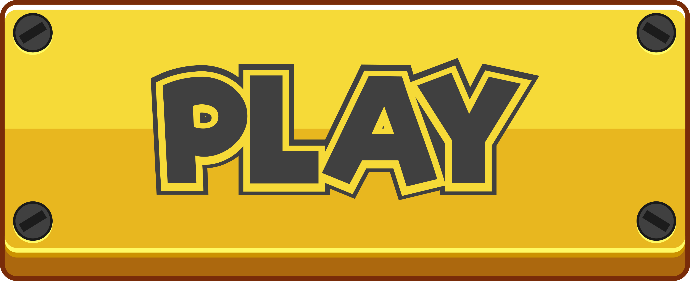

## Typing Game

This is a simple typing game built with React.js. In this game, bubbles of words fall from the top of the screen and the player must type out the words on the bubbles using their keyboard. The objective of the game is to shoot as many bubbles as possible before they reach the bottom of the screen.

### In Game
[](https://word-asteroid-game.vercel.app/)

**In game screenshot 001**


**In game screenshot 002**


### Installation

To install and run the game on your local machine, please follow these steps:

1. Clone the repository to your local machine using the following command:

```bash
git clone https://github.com/your-username/typing-game.git
```
2. Change directory to the project folder using the following command:

```bash
cs word_asteroid_game
```
3. Install the required dependencies using the following command:

```bash
npm install
```

4. Open your web browser and go to `http://localhost:3000` to play the game.

### How to Play

- Type the words on the bubbles to shoot them down.
- When a bubble with a word on it reaches the bottom of the screen, the game is over.
- Shooting down a bubble will earn you points.
- The game gets progressively harder as you shoot down more bubbles

### Credits
This game was built using React.js and styled using CSS. The idea for the game was inspired by [ZType](https://zty.pe/). 
Go check out their [Github Repo](https://github.com/johnBuffer/ZTyper).
